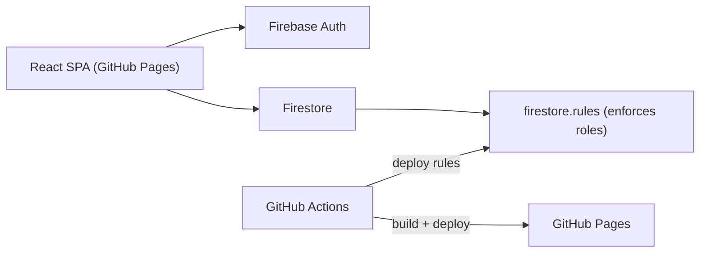

# Malcolm X Respiratory Therapy Class Announcements

## How the pieces fit

GitHub Pages only serves the built HTML, JavaScript and CSS files. The browser talks directly to Firebase. All permission checks happen in `firestore.rules`, which run on Firebase's side, so a user can't bypass them by editing the JavaScript.



## Stack and versions (latest on npm as of Oct 2026)

These are the versions to install. They will be pinned in `package.json` when the project is created.

- Node 24.19 (already installed).
- React 19.3.
- Vite 8.3, with `@vitejs/plugin-react` 6.1.
- TypeScript 6.0.3, kept light: see the simplifications below.
  - TypeScript 7.0 is out, but the ESLint TypeScript plugin `typescript-eslint` 8.71 only supports versions below 6.1.
  - Your `ih_planner` project uses the same ESLint setup, so TypeScript 6.0 keeps the two projects consistent.
- `react-router` 8.4.
  - This one package now replaces `react-router-dom`.
  - It uses a hash router, so URLs work on GitHub Pages, which can't rewrite URLs on the server.
- `firebase` 12.19, the modular SDK for Auth and Firestore. Everything stays on the free Spark plan.
- Tailwind CSS 4.3, set up through the `@tailwindcss/vite` plugin with no config file.
- Vitest 5.0 for tests.
- `firebase-tools` 15.32, the Firebase command-line tool, used to deploy `firestore.rules` and indexes. It doesn't need Java for this.
- **Local emulator deferred to phase 6:**
  - Until then, development runs against the real free Firebase project. A class-sized app in development stays far under the daily quota.
  - In phase 6, install Java 21 (the free Eclipse Temurin build) with `winget install EclipseAdoptium.Temurin.21.JDK`.
  - Then add the emulator config and `@firebase/rules-unit-testing` 5.0 for automated rules tests.
- **UI kit, same as `ih_planner`:**
  - shadcn/ui components (style `new-york`, base color `neutral`) built on Radix.
  - `lucide-react` icons and `sonner` toast notifications.
  - `@tanstack/react-table` (MIT, free) for the admin data tables, following shadcn's data-table pattern. Added in phase 5.
  - Relative times ("3h ago") use the built-in `Intl.RelativeTimeFormat`, no date library.
  - `clsx`, `tailwind-merge` and `class-variance-authority`, combined through a `cn()` helper.
  - `tw-animate-css` for animations.
- **Tooling, same as `ih_planner`:**
  - ESLint 9 using the same flat config: `typescript-eslint`, react, react-hooks, sorted import order, `consistent-type-imports`, `curly: all`, and blank lines around control statements.
  - Prettier 3 with single quotes, semicolons, 4-space indentation, 80-character lines, and `prettier-plugin-tailwindcss` (which also sorts classes inside `cn`, `clsx` and `cva`).
  - Scripts: `dev`, `build`, `lint`, `lint:check`, `format`, `format:check`, `types:check`, `test`.

## Keep-it-simple choices for the first version

- **Light TypeScript:**
  - Data shapes (`ClassGroup`, `Role`, `UserProfile`, `UserContact`, `Post`, `Comment`) are typed once in [src/types/index.ts](src/types/index.ts).
  - Everything else relies on type inference, so most code looks like plain JavaScript.
  - No advanced generics.
- **Plain forms:** `useState` with controlled inputs and a small manual check before saving. No form libraries.
- **Plain-text posts at first:** line breaks are preserved. `react-markdown` comes later, together with image links.
- **No data-fetching library:** a few small custom hooks wrap Firestore's live listener (`onSnapshot`).
- **Roles:**
  - Seed three default roles: Admin, Moderator and Student.
  - The first admin screen only assigns roles to users.
  - The full custom-role editor comes in a later phase. The data model already supports it, so nothing has to be rewritten.
- **Deploy early:** a "hello world" page goes live on GitHub Pages on day 1, so hosting problems show up early.

## Firestore compared with MySQL

Firestore has no SQL. Here is how its concepts map to what you know:

- A **collection** is like a table. A **document** is like a row, but it's stored as JSON with no fixed schema.
- A **document ID** is like a primary key.
- A **subcollection** (`posts/{id}/comments`) is like a child table whose foreign key is built into its path.
- **There are no JOINs.** Either copy values onto each document or "join" on the client. At class size this app joins on the client (see Data model).
- **No foreign keys, cascades, or unique constraints** except the document ID. Rules can check `exists()`; uniqueness comes from meaningful IDs (`roles/admin`, `users/{uid}`).
- **Many-to-many uses arrays** for small sets (`roleIds`, `classIds`) instead of pivot collections, because rules can't query a pivot collection.
- **Rules can't query or loop** and allow at most 10 document lookups per request, so permission checks must be shallow (hence the stored `permissions` array).
- **Rules are per document, not per field** — private fields go in a separate document (`userContacts`).
- **A missing field is not null** — always write `deletedAt: null` on create.
- **You pay per document read**, not per query (Spark: 50k reads / 20k writes / 20k deletes per day, 1 GiB stored). Design for reads.
- `where`, `orderBy` and `limit` in the SDK work like `WHERE`, `ORDER BY` and `LIMIT`.
- Queries that filter or sort on several fields need a **composite index**, declared in `firestore.indexes.json`.
- **Security rules** act like MySQL `GRANT`s plus per-row checks in one file. Every read and write passes through them.

## Authentication (school email only)

- Students sign up with email and password, then must verify their email before they can do anything.
- Allowed domains (confirmed): `@student.ccc.edu` for students and `@ccc.edu` for instructors.
  - They're set once in [src/lib/config.ts](src/lib/config.ts) as `ALLOWED_EMAIL_DOMAINS = ['student.ccc.edu', 'ccc.edu']`.
  - The same pattern appears in `firestore.rules`.
- The domain check is case-insensitive, so `Name@Student.CCC.edu` also works.
- The domain restriction is enforced twice:
  - In the UI, so users get a clear error.
  - In `firestore.rules`, which is the actual protection:

```
function isMember() {
  return request.auth != null
    && request.auth.token.email_verified == true
    && request.auth.token.email.lower().matches('^[^@]+@(student[.])?ccc[.]edu$');
}
```

- Optional later: add a "Sign in with Microsoft" button, since City Colleges of Chicago uses Microsoft 365.

## Data model (Firestore) — decided 2026-10-08

Designed normalized first (MySQL-style ERD), then mapped to Firestore. Field names are camelCase so documents map straight onto the TS types.

**Conventions on every collection:**

- `createdAt` and `updatedAt` are server timestamps (`serverTimestamp()`); rules check `createdAt == request.time` on create and `updatedAt == request.time` on every write.
- Soft delete (`users`, `posts`, `comments`): `deletedAt: Timestamp | null`. Every create writes `deletedAt: null` explicitly, because Firestore's `where('deletedAt', '==', null)` doesn't match documents where the field is missing. Rules enforce it.
- IDs are Firestore auto IDs, except `users/{uid}` (Firebase Auth uid) and `roles/{slug}` (readable, unique by construction).

**Collections:**

- `classes/{classId}`: `{ name, startYear, endYear | null, archivedAt | null, createdAt, updatedAt }`
  - A class is archived instead of deleted.
- `roles/{roleId}` (master/reference table, no enums): `{ name, color, permissions: string[], createdAt, updatedAt }`
  - `roleId` is a slug: `admin`, `moderator`, `student` (seeded; admins can add more, e.g. `instructor`).
  - Permissions are named constants in code (`src/lib/permissions.ts`), because each one only works once the code and `firestore.rules` check it: `posts.create`, `posts.edit_any`, `posts.delete_any`, `posts.pin`, `comments.delete_any`, `users.manage`, `roles.manage`, `classes.manage`.
- `users/{uid}`: `{ firstName, lastName, email, classIds: string[], roleIds: string[], permissions: string[], createdAt, updatedAt, deletedAt }`
  - **Many-to-many as arrays** (Firestore's pivot table for small sets): a user can be in many classes (instructors) and hold many roles.
  - **New users are "pending":** they sign up with `classIds: []`, `roleIds: []`, `permissions: []` and see a waiting screen until someone with `users.manage` assigns a class and roles.
  - `roleIds` is the source of truth. `permissions` is a derived copy of the combined permissions of the user's roles, because security rules can't loop over roles. Whenever an admin changes a role or a user's roles, the admin screen recalculates `permissions` for the affected users in one batched write. This is the one deliberate denormalization.
  - Email must be `@student.ccc.edu` or `@ccc.edu` (copied from Auth; rules check it matches the token).
- `userContacts/{uid}`: `{ phone, smsOptIn, smsOptInAt | null, updatedAt }`
  - Separate document because Firestore rules are per document, not per field: only the owner and `users.manage` can read it.
  - `phone` is stored in E.164 format (`+13125551234`). The opt-in flag and its timestamp are kept now so SMS later needs no migration (US texting requires consent).
- `posts/{postId}`: `{ classId, userId, title, body, links: { url, label }[], pinned, createdAt, updatedAt, deletedAt }`
  - Each post belongs to one class and has exactly one author.
  - `links` is embedded (max ~10): files live in external apps (Drive, OneDrive, Cloudinary later) and the post only references them. Links are never queried alone, so a subcollection would only add one read per post in the feed.
- `posts/{postId}/comments/{commentId}`: `{ userId, parentId | null, body, createdAt, updatedAt, deletedAt }`
  - The post ID is part of the path (like a foreign key). "All comments by a user" uses a collection-group query on `userId`.
  - Threaded replies: the client builds the reply tree from `parentId` (depth limit 5). Soft-deleted comments show as "[deleted]" so their replies stay in place, like Reddit.

**Joins and counts (stay normalized at class size):**

- Author names are not copied onto posts or comments. The app loads the current class's users once (about 40 reads) into a map and looks up `userId → name` on the client. If the app grows to hundreds of users per class, copy `authorName` onto posts then.
- Comment counts use Firestore's `count()` aggregation (not live). A stored `commentCount` is the fallback if live counts are needed.

## Authorization rules (summary for [firestore.rules](firestore.rules))

- Every read requires `isMember()`, so nothing is public.
- Class content (posts, comments) is only readable by users whose `classIds` contain the post's `classId`. Pending users (no classes) can only read their own profile.
- `users/{uid}`:
  - On create, users can only create their own document, with empty `classIds`, `roleIds` and `permissions`, and `deletedAt: null`.
  - On update, users can only change `firstName` and `lastName`.
  - Anyone with `users.manage` can change `classIds`, `roleIds` and `permissions`.
- `userContacts/{uid}`: read/write by the owner; read by `users.manage`.
- `classes`: readable by members; only `classes.manage` can write.
- `roles`: only `roles.manage` can write.
- `posts`:
  - Create requires `posts.create`, `userId` must equal the logged-in user, and `classId` must be one of the user's `classIds`.
  - Update is allowed for the author, or anyone with `posts.edit_any`. `pinned` can only change with `posts.pin`.
  - Delete is allowed for the author, or anyone with `posts.delete_any`.
  - Delete means soft delete (`deletedAt` set). Restoring (`deletedAt` back to `null`) and soft-deleted items in admin tables require `posts.delete_any` (`comments.delete_any` for comments).
- `comments`:
  - Any verified member can create a comment as themselves.
  - The author can edit or soft-delete their own comment.
  - Anyone with `comments.delete_any` can moderate comments.
- A helper function looks up the current user's permissions:

```
function perms() { return get(/databases/$(database)/documents/users/$(request.auth.uid)).data.permissions; }
function can(p) { return isMember() && p in perms(); }
```

- The first admin is set up once by hand in the Firebase console: create an `Admin` role with all permissions and assign it to your user. The repository will include written steps for this.

## Two interfaces, one SPA — decided 2026-10-08

One React app, one `index.html`. Two nested layout routes in `src/router.tsx` give two different looks:

- **Student board (Reddit-style)** — `board-layout.tsx`, routes at `/`.
- **Admin panel (CRM-style)** — `admin-layout.tsx`, routes under `/admin/*`, **lazy-loaded** (route `lazy`) so students never download admin code. This also trims the main bundle.

Both use the same hooks, types, `AuthProvider` and `firestore.rules`; only the layouts and page components differ.

### Student board (Reddit-style)

- **Top bar:** app name, **class switcher** (like switching subreddits; only shows when a user has more than one class), title search (client-side filter), "Create post" button (if `posts.create`), user menu (profile, admin panel link if the user has any admin permission, log out).
- **Feed (center column):** compact post cards — title, author, relative time, link chips, comment count. Pinned posts first ("Pinned" badge), then newest. "Load more" paging of 20.
- **Right sidebar (`lg` and up only):** class info card (name, years, member count), pinned quick links.
- **Post page:** post with its links, then the **threaded comment tree** — indented replies with thread lines, collapse/expand per thread, inline reply box, "[deleted]" placeholders, depth limit 5 ("Continue this thread" link beyond it).
- **Mobile:** single column; the sidebar content moves into a sheet/drawer; large touch targets.

### Admin panel (CRM-style)

- **Shell:** collapsible left sidebar (shadcn `sidebar`), top bar with breadcrumbs and user menu, "Back to board" link. On mobile the sidebar becomes a drawer.
- **Access:** visible to users with at least one admin permission (`users.manage`, `roles.manage`, `classes.manage`, `posts.delete_any`, `comments.delete_any`); each section is gated by its own permission, in the UI **and** in `firestore.rules`.
- **Data tables** (shadcn data-table pattern on `@tanstack/react-table`): search, filters (class, role, status: active / pending / deleted), sortable columns, pagination, column visibility, row selection with **bulk actions**.
  - Filtering and search run in memory: at class scale the admin loads the whole collection (a few hundred documents). Firestore has no `LIKE`/full-text search; if this ever grows past that, add lowercase prefix-search fields first.
- **Record detail pages:** tabs for profile, contact info, classes and roles, and activity (that user's posts and comments).

| Route | Purpose |
| --- | --- |
| `/admin` | Dashboard: pending users count, members per class, posts this week (`count()` aggregations) |
| `/admin/users`, `/admin/users/:uid` | Users table + detail; approve pending users; bulk assign class/role; bulk "email selected" (`mailto:` BCC); soft delete / restore |
| `/admin/classes`, `/admin/classes/:id` | Classes table + detail with its members; create, edit, archive |
| `/admin/roles` | Roles table; create/edit roles with permission checkboxes (recalculates users' `permissions`) |
| `/admin/posts`, `/admin/comments` | Moderation tables including soft-deleted items; restore or delete |

### Other routes

- `/login`, `/signup`, `/verify-email`, `/forgot-password` use `auth-layout.tsx` and are open to anyone.
- `/pending` is shown to signed-in users with no class yet ("waiting for an admin to add you to a class").
- `/posts/new` and `/posts/:id/edit` require the `posts.create` permission or post ownership.
- `/profile` lets users change their name and contact number (with SMS opt-in).
- Each page handles loading, empty and error states.
- An `AuthProvider` context exposes `user`, `profile` and `can(permission)`.

## Proposed structure (mirrors `ih_planner/resources/js`)

All filenames are kebab-case, such as `post-card.tsx` or `use-posts.ts`. Imports use the `@/` alias, which points to `src/`.

- [src/main.tsx](src/main.tsx) and [src/router.tsx](src/router.tsx): app entry point and the single list of routes.
- [src/index.css](src/index.css): sets up Tailwind v4 (`@import "tailwindcss"`) and the theme through `@theme`.
- [src/components/ui/](src/components/ui/): shadcn components such as `button`, `input`, `card`, `dialog` and `dropdown-menu`.
- [src/components/](src/components/): app components, grouped into subfolders as in `ih_planner`:
  - `components/board/`: `board-top-bar`, `class-switcher`, `class-sidebar`.
  - `components/posts/`: `post-card`, `post-form`, `link-chips`.
  - `components/comments/`: `comment-thread`, `comment-form`.
  - `components/admin/`: `admin-sidebar`, `data-table` (generic table shell), `stat-card`, `role-badge`, `user-role-editor`, `bulk-actions-bar`.
  - `components/auth/`: `require-auth`, `require-permission`.
- [src/layouts/](src/layouts/): `board-layout.tsx` (Reddit-style top bar, feed column, right sidebar), `admin-layout.tsx` (CRM sidebar shell) and `auth-layout.tsx`.
- [src/pages/](src/pages/): one file per route, for example `pages/posts/index.tsx`, `pages/posts/show.tsx`, `pages/auth/login.tsx`, `pages/admin/dashboard.tsx`, `pages/admin/users/index.tsx` and `pages/admin/users/show.tsx`.
- [src/hooks/](src/hooks/): `use-auth.ts`, `use-posts.ts`, `use-post.ts`, `use-comments.ts` and `use-roles.ts`.
  - Lists use plural names (`posts`) and single items use singular names (`post`), matching your prop-naming rule.
- [src/lib/](src/lib/): `firebase.ts` (setup from `VITE_FIREBASE_*` environment variables), `utils.ts` (`cn`), `permissions.ts` and `comment-tree.ts`.
- [src/types/index.ts](src/types/index.ts): shared types `ClassGroup` (`Class` is a reserved-looking name in TS), `Role`, `UserProfile`, `UserContact`, `Post`, `PostLink`, `Comment` and `Permission`.
- [src/context/auth-provider.tsx](src/context/auth-provider.tsx): provides `user`, `profile` and `can(permission)`.
- [firestore.rules](firestore.rules), [firestore.indexes.json](firestore.indexes.json), [firebase.json](firebase.json).
- [tests/rules.test.ts](tests/rules.test.ts), added in phase 6 once Java is installed: tests the rules against the emulator, covering cases like non-school emails, unverified users, users promoting themselves, and editing someone else's post.
- [.github/workflows/deploy.yml](.github/workflows/deploy.yml): builds with Vite and deploys to Pages.
- `vite.config.ts` sets `base: '/<repo-name>/'` so asset paths work under the GitHub Pages subpath.

## Cursor rules for this repo (adapted from `ih_planner/.cursor`)

This follows your `RULES_ARCHITECTURE.md`: a short project rule plus focused rules that only apply to matching files.

- [.cursor/rules/GENERAL.mdc](.cursor/rules/GENERAL.mdc), always applied, covers:
  - The stack: React, TypeScript, Vite, Tailwind v4, Firebase on Spark, hosted on GitHub Pages.
  - The folder layout, kebab-case filenames and `@/` aliases.
  - That it must stay free: no Blaze plan, no Cloud Functions, no Firebase Storage.
  - **Explicit overrides of your Laravel-focused global rules.** This project has no Laravel, so:
    - Routes live in `src/router.tsx`.
    - `firestore.rules` plays the role that Laravel policies and Form Requests play: the backend contract.
    - Data comes from Firestore hooks, not Inertia props.
    - Links use react-router's `<Link>`.
- [.cursor/rules/imports-and-exports.mdc](.cursor/rules/imports-and-exports.mdc): copied from `ih_planner`, with the file patterns changed to `src/**/*.ts` and `src/**/*.tsx`.
- [.cursor/rules/responsive-design.mdc](.cursor/rules/responsive-design.mdc): copied from `ih_planner`, with the file patterns changed to `src/**/*.tsx` and `src/**/*.css`.
- [.cursor/skills/tailwindcss-development/](.cursor/skills/tailwindcss-development/): copied unchanged.
- **Not copied:**
  - The Laravel, Fortify, Wayfinder and Inertia skills.
  - `mcp.json` (Laravel Boost).
  - The game datamine files.

## Deployment

- The Firebase web config is committed in `.env.production`, which the build reads. These values are not secrets (they ship to every browser), and this avoids any GitHub settings. Local dev uses a gitignored `.env.local`.
- Add `<username>.github.io` to Firebase Auth's authorized domains.
- Deploy the rules with `firebase deploy --only firestore:rules`, either by hand or from a second CI job.

## Timeline

The estimates assume part-time work of about 1 to 2 hours a day. I write most of the code. Your time goes into Firebase console setup, reviewing changes and testing with real accounts.

- **Phase 0, setup (days 1-2):**
  - Create the Firebase project on Spark.
  - Scaffold Vite, React, TypeScript, Tailwind and the router.
  - Add the GitHub Actions workflow and put a "hello world" page live on Pages.
- **Phase 1, authentication (days 3-5):**
  - Sign up, log in, log out, email verification and password reset.
  - School-domain check.
  - Create the user profile document on first login.
  - Protected routes.
- **Phase 2, rules and roles foundation (days 6-7):**
  - Write `firestore.rules`.
  - Seed the Admin, Moderator and Student roles and make yourself admin.
  - Do quick manual rule checks in the Firebase console's **Rules Playground**, which runs in the browser and needs no Java.
- **Phase 3, posts (days 8-11):**
  - Reddit-style `board-layout` (top bar, class switcher, right sidebar).
  - Feed with pinned posts first and "load more" paging of 20 posts.
  - Create, edit and delete posts, and pin or unpin.
  - Each page handles loading, empty and error states.
- **Phase 4, threaded comments (days 12-15):**
  - Comment, reply, edit and soft delete.
  - Moderator deletion.
  - Nested display with a depth limit, for example 5 levels.
  - Comment counts.
- **Phase 5, CRM admin panel (days 16-21):**
  - Lazy-loaded `admin-layout` with sidebar, breadcrumbs and dashboard stat cards.
  - Shared data-table component (search, filters, sorting, paging, row selection, bulk actions).
  - Users table + detail page (approve pending users, assign classes and roles, soft delete / restore, "email selected").
  - Classes table + detail; roles table with permission checkboxes and permissions recalculation.
  - Posts and comments moderation tables, including restore.
  - Until this phase, pending users are approved by hand in the Firebase console (or through the Firebase MCP, with your OK).
- **Phase 6, polish and launch (days 22-24):**
  - Install Java 21 with winget.
  - Add the emulator and automated rules tests.
  - Mobile layout check and accessibility pass.
  - Invite the class.

That's about 4 weeks part-time for a version the class can use. Phases 0 to 3 alone, about 2 weeks, already give a usable announcement board.

## After launch (all free)

- **Image links:** paste an image URL, rendered through `react-markdown`. This is when markdown support gets added.
- **Cloudinary uploads:** unsigned uploads to Cloudinary's free tier, which doesn't need a card.
- **Email the class:** an admin button that opens a `mailto:` link with every student in BCC (sent from the instructor's own school account).
- **EmailJS:** sending from the browser, at about 200 emails a month on the free tier.
- **SMS:** no reliable free option. Twilio and similar cost per message, need a server for the secret key, and US business texting needs A2P 10DLC registration; carrier email-to-text gateways are shutting down (AT&T ended its gateway in 2025). Free route: link the app to a **Remind** class (free for teachers, sends SMS) or a GroupMe group. Phone numbers (E.164) and SMS opt-in are stored from v1 so a paid option stays possible.
- **Unread badge:** store `lastSeenAt` on each user and highlight posts newer than it. This is free, with no email needed.
- **Post categories:** tags such as Exam, Clinical, Lab or General, with a filter on the feed.
- **Due-date posts:** an optional `dueAt` field and an "Upcoming" section at the top of the feed.
- **Installable app (PWA):** students can add the site to their phone home screen. Push notifications are left out because they need a server.
- **Upvotes (decided: after launch):** `posts/{postId}/votes/{uid}` with the user's uid as the document ID, so each user can vote once. A stored `score` on the post, updated in the same batch, enables "Top" sorting. The v1 feed sorts Pinned, then New.

Firebase Storage and Cloud Functions are not used, because both need the paid Blaze plan.